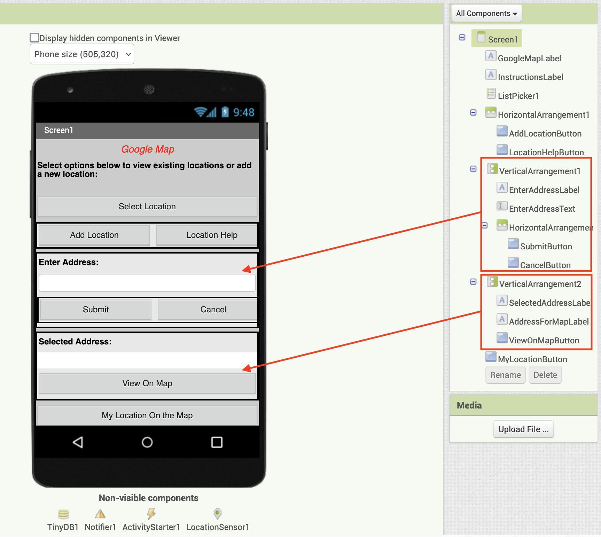
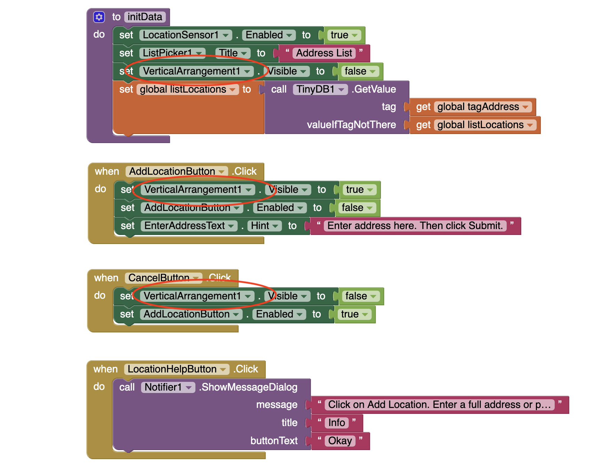
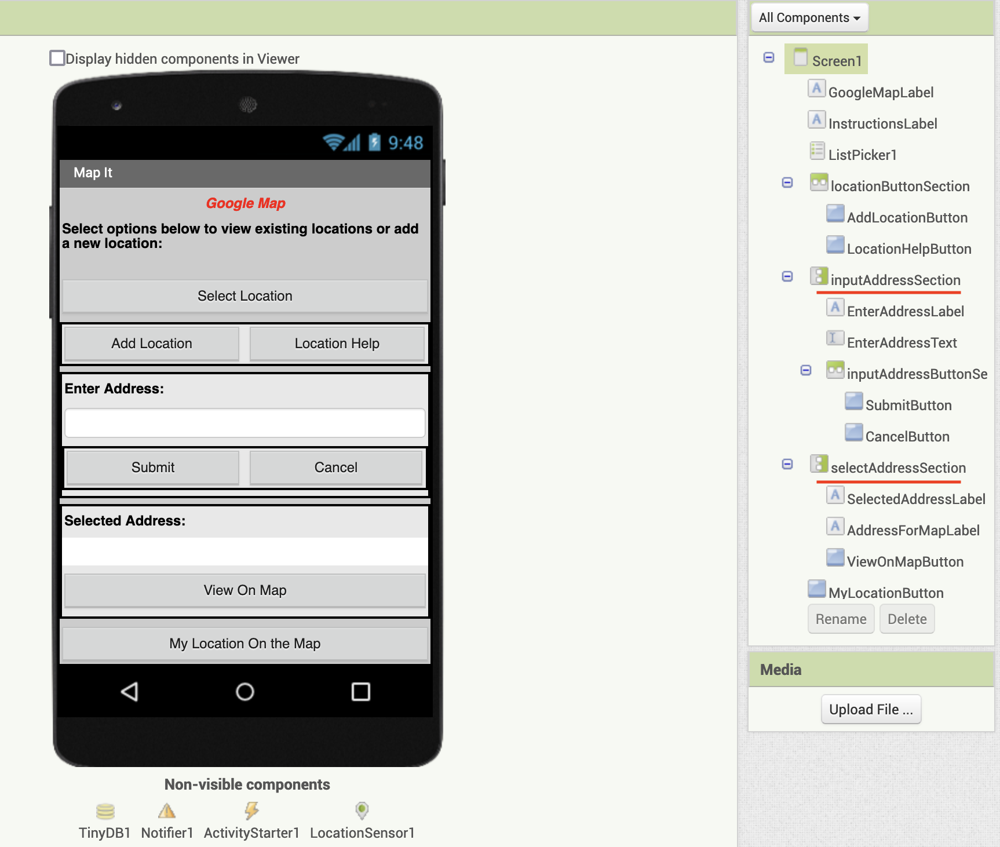
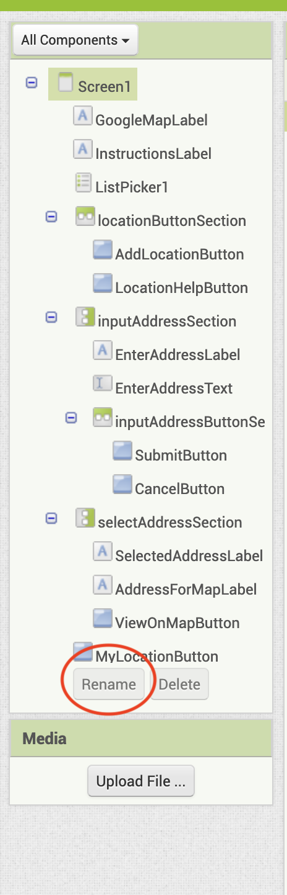
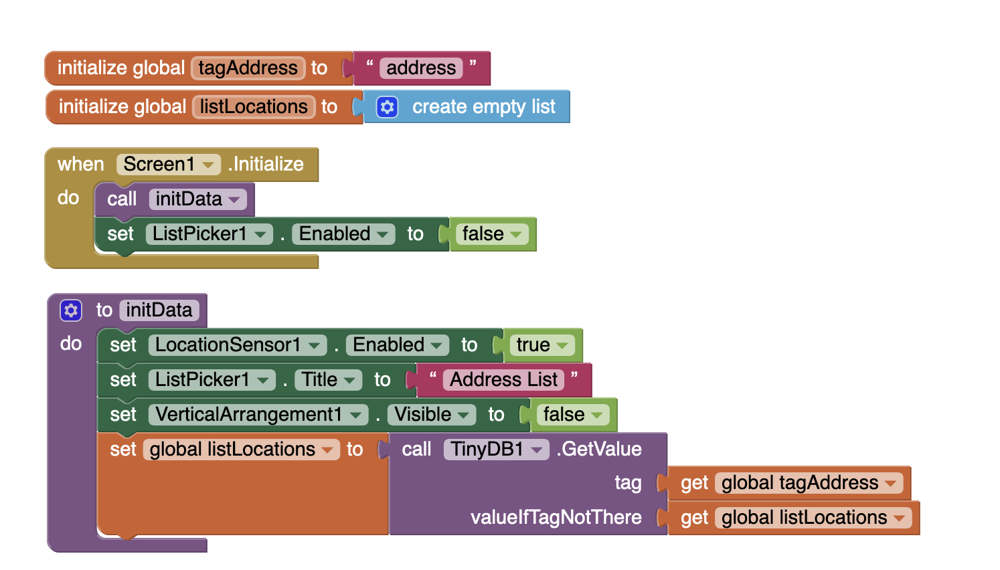
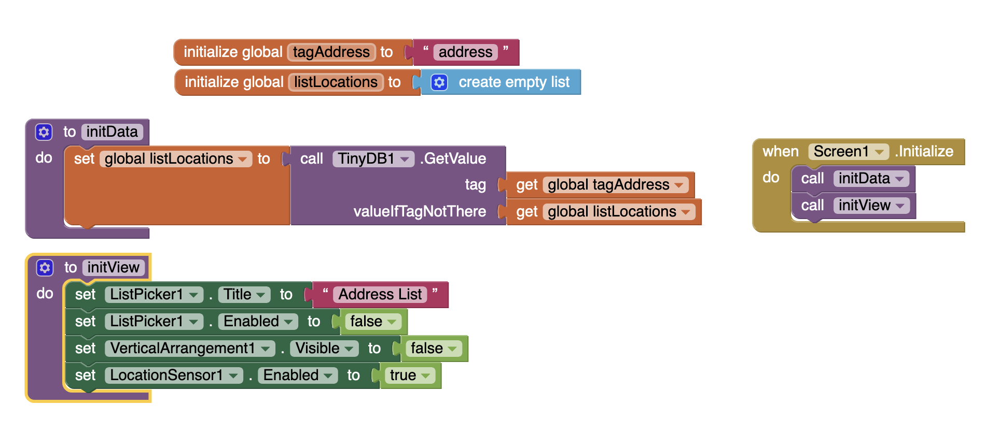
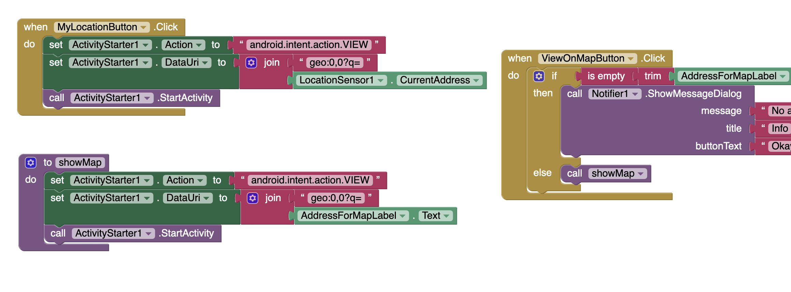
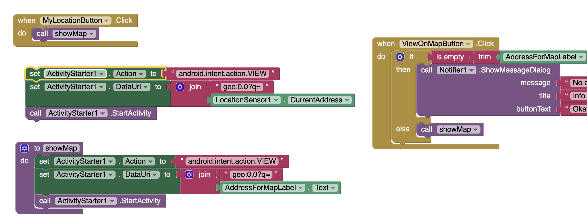
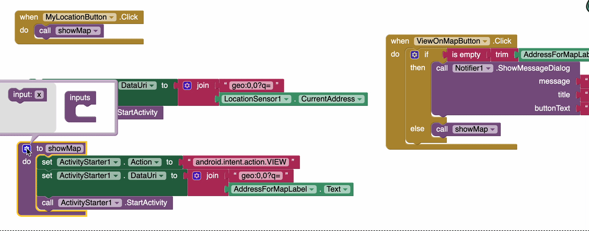
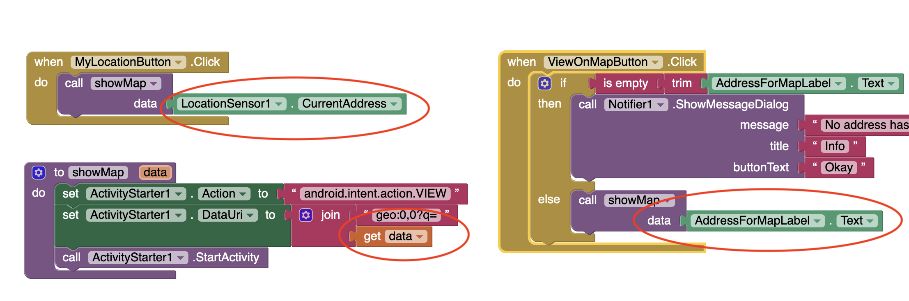

# Map It Refactor Guide
_A guide for refactoring activities in `AI2` using the app Map It as an example._

## Introduction
This repository is intended as a guide to support refactoring activities using `AI2`. It's important to note a couple caveats up front:
1. Refactoring in `AI2` is going more arbitrary than if we were using a typical programming language: Because `AI2` is a block-based coding environment, we don't have the same inherent document-oriented structure that we would have if we were coding in a typical programming language (like Java, or Kotlin, or JavaScript). Instead, we'll try to develop good organizational practices in the arrangement of our blocks to simulate the standard approach.
2. `AI2` doesn't have syntax highlighting in the same way that standard programming languages do: However, `AI2` blocks are colour coded. We can use these colours to help us understand the structure of our `AI2` programs at a glance.
3. Typical software best practices don't all immediately apply to `AI2`: This includes good architectural practices. However, we're going to work as hard as we can to apply good architectural practices to our `AI2` code blocks.

The argument I'm making here is that although `AI2` isn't well-suited to some of our main interests (i.e. good architecture, refactoring, documentation, etc.) by bringing these interests front-and-centre with a less-than-ideal tool forces us to carefully consider the meaning behind those interests, and strategies that could apply more broadly to multiple languages, frameworks and environments. This will sometimes be uncomfortable, in that some of the things we do may seem unnecessary in `AI2`. Furthermore, since everyone in DGL 104 is an `AI2` novice, you're all starting from the same level of experience. 

## How to use this repository
This repository contains:
1. A guide (this document) describing some refactoring techniques you can use in `AI2`.
2. A complete version of the Map It app ([MapIt_MIT.aia]()) downloaded from the [Map It tutorial](https://appinventor.mit.edu/explore/displaying-maps).
3. A modified version of the Map It app ([MapIt_MIT_partial_refactor.aia]()) on a separate branch of the repository. 

You should clone this repository so that you have copies of both `.aia` files locally. You are welcome to follow the steps in the guide below, or to strike out on your own, if you're feeling comfortable with `AI2` already.

## A guide to refactoring in `AI2`

### Goal
The main goal of this guide is to present you with some ideas to consider when refactoring `AI2` code blocks. This will help you in the following ways:
1. It will improve your understanding of `AI2`-based development.
2. It will help you identify potential refactoring strategies for your own `AI2` project.

As part of your Week 3 homework you are required to complete a partial refactor of the Map It project. If you follow along with this guide you will get a sense of the scope of changes possible. There are plenty of other opportunities for refactoring Map It, beyond what is presented here.

### Refactoring identifier names
It's important to remember that most of the refactoring we'll do (in this assignment and others) will be focused on improving code for other _developers_ - and not necessarily for the end-user. In that sense, our refactors will spend less time in the `AI2` designer environment and more time in the blocks environment. 

However, it is worth noting that identifier names for components are often a source of confusion when working in the blocks environment. The default names provided by `AI2` when adding a new component is to give it an identifier name that includes a number appended to the name of the component. Thus, if you add two Vertical Arrangement components to your app you will end up with a `VerticalArrangement1` and a `VerticalArrangement2` component in your hierarchy. This is precisely the situation in the base version of Map It:

In the designer environment it's not so difficult to distinguish one from another. However, when moving into the blocks environment there is no longer any clear visual indicator to help the developer understand which vertical arrangement is which:

To solve this issue it is a good idea to rename components that may be less easy to identify from their default names. If you take this approach it is advisable that you come up with a naming scheme that you can apply consistently across the entire project. For example `inputAddressSection` and `selectAddressSection` for the two vertical arrangements, respectively, as pictured below:

To change the name of any component you must select the component you would like to rename from the component hierarchy and click on the `Rename` button at the bottom of the component hierarchy list:

### Refactoring the first four blocks
The first four blocks of the base Map It code are two global variable declarations, a `when Screen1.initialize` event, and an `initData` procedure:

Let's think about the program flow:
1. Global variables are initialized
2. `Screen1.initialize` is called
3. `initData` is called as part of `Screen1.initialize`

> Note: I think it's important to pause here and recognize that although global variables are a **necessity** in `AI2`. While in typical programming environments we'll avoid globals as much as possible, in `AI2` we must make use of global variables as a key data structure. This is one of those uncomfortable things I referenced above. We'll roll with it, but please recognize that the use of global variables _here_ is not to be considered an argument for using global variables elsewhere.

The rest of the app is entirely event-based, so the flow above represents all of the automatically executed code that is run every time the app is opened.  

What should we consider here? First, we're stuck with global variables, so we can't do much with those (notice in particular that orange global declaration do not have sockets - so you can't even attach them to any other procedure). Instead, let's look at the composition of the `initData` procedure: What is interesting to me is that much of what `initData` does is not actually data-related. Instead, `initData` initializes _three_ screen components and _one_ actual data structure (the `listLocations` list). Wouldn't it be better, then, to do the following:

#### `initData`
The modified `initData` concerns itself _only_ with initializing actual data - and not screen components. Notice that `initData` does actually initialize data (i.e. the equivalent of an [assignment statement](https://en.wikipedia.org/wiki/Assignment_(computer_science)) in a more traditional programming language); in contrast to the [declaration](https://en.wikipedia.org/wiki/Declaration_(computer_programming)) of the global variables which occur in the `initialize global...` blocks.

#### `initView`
The new `initView` procedure collects all the screen component-related initializations that occurred in both the former `initData` and in the `Screen1.initialize` event. The procedure is called `initView` as a nod toward the typical approach to [MVC architecture](https://en.wikipedia.org/wiki/Model%E2%80%93view%E2%80%93controller), which we'll discuss in more detail later in the semester. Notice as well that the screen components in `initView` are grouped according to component: both `ListPicker1` calls are grouped together first, with the call to set `enable` to `false` intentionally second. 

#### `Screen1.initialize`
Finally, of course we need some way to call the new `initView` procedure, so it is added to the `Screen1.initialize` event. You can think of this event as your [program entry point](https://en.wikipedia.org/wiki/Entry_point), since it will fire every time the app is opened.

### Refactoring `showMap`
In examining other Map It code blocks you may have noticed that there is some very similar code in the `when MyLocationButton.click` event and the `showMap` procedure. You may also have noticed that `showMap` is called only once in the program, in the `else` branch of the `when ViewOnMapButton.click` event. Clearly, we want to reduce code repetition as much as possible - but how do we do this with code blocks?

The best place to start is to recognize that the `showMap` procedure can be reused. We can modify the `when MyLocationButton.click` event so it looks like this:

But we've lost some data. I've kept the orphaned code blocks in the image so that you can see the difference: Notice that in original case of `when MyLocationButton.click` the data passed in came from the `LocationSensor1.CurrentAddress` field; whereas in the `when ViewOnMapButton.click` event the data passed in comes from the `AddressForMapLabel` textbox. To fix this we can declare a parameter for the `showMap` procedure:

Now we can modify `showMap` to use the `data` parameter to make it more generic, and then we pass in either `LocationSensor1.CurrentAddress` or `AddressForMapLabel` as argument data, depending on which event called `showMap`:

## Conclusion
Hopefully the changes outlined above give you some hints for where you can look to make your own modifications to Map It. There are certainly some additional repeated code opportunities, but there are also some further changes that can be made to the overall structure of the app to make it cleaner and more architecturally sound. Feel free to reach out on Slack if you'd like to discuss changes you have in mind!
